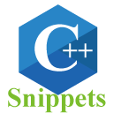

# cpp-sub-snippets README

C++ Snippets list.

The basic snippets as of VS Code (ver1.61) are as follows.

+ `class`
+ `classi`
+ `classt`
+ `do`
+ `elif`
+ `else`
+ `for`
+ `forr`
+ `forrange`
+ `if`
+ `ifd`
+ `ifel`
+ `ifelif`
+ `ifnd`
+ `main`
+ `mitl`
+ `namesp`
+ `struct`
+ `switch`
+ `try`
+ `union`
+ `while`
+ `wmain`
+ `#endregion`
+ `#region`

Add a snippet other than the above.

[Example](docs/snippets.md)

+ `#if`
+ `#elif`
+ `#else`
+ `#define`
+ `#ifdef`
+ `#ifndef`
+ `#include`(`#inc`)
+ `#include-guards`(`#hdr`)
+ `has-include`
+ `noreturn`
+ `carries_dependency`
+ `deprecated`
+ `nodiscard`
+ `maybe_unused`
+ `fallthrough`
+ `no_unique_address`
+ `likely`
+ `unlikely`
+ `concept`
+ `static_assert`(`sta`)
+ `if-constexpr`(`ifc`)
+ `alignas`
+ `alignof`
+ `using new name`
+ `template using new name`
+ `user defined literal integral`(`udli`)
+ `user defined literal float`(`udlf`)
+ `user defined literal character`(`udlc`)
+ `user defined literal string`(`udls`)
+ `user defined literal raw`(`udlr`)
+ `user defined literal template`(`udlt`)
