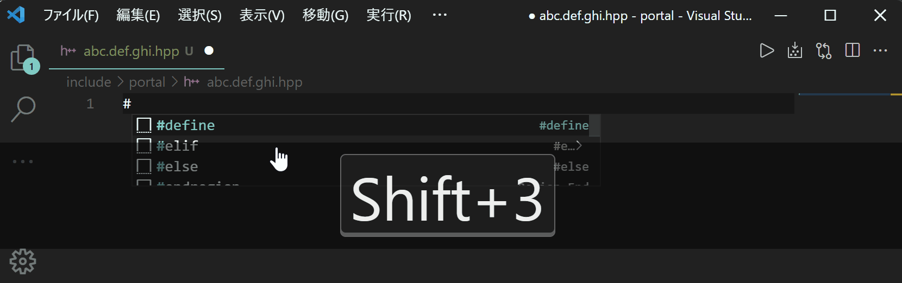

# README

This extension adds snippets that are not provided by default.

## Release Notes

### 1.0.0

Preprocessor and attribute keywords and keyword

- `#if`
- `#elif`
- `#else`
- `#define`
- `#ifdef`
- `#ifndef`
- `#include-guards`(`#hdr`)
- `has-include`
- `noreturn`
- `carries_dependency`
- `deprecated`
- `nodiscard`
- `maybe_unused`
- `fallthrough`
- `no_unique_address`
- `likely`
- `unlikely`
- `concept`
- `static_assert`(`sta`)
- `if-constexpr`(`ifc`)
- `alignas`
- `alignof`

### 1.1.0

Preprocessor

- `#include`

### 1.2.0

`using` keyword

- `using new name`
- `template using new name`

### 1.3.0

user defined literal

- `user defined literal integral`(`udli`)
- `user defined literal float`(`udlf`)
- `user defined literal character`(`udlc`)
- `user defined literal string`(`udls`)
- `user defined literal raw`(`udlr`)
- `user defined literal template`(`udlt`)

### 1.4.0

C++20 coroutine class sample

- `coroutine generator class`

### 1.5.0

Select an attribute from the list.

The numbers correspond to the relevant C++ version.

example: `attr11` - C++11 attribute

- `attr11`
- `attr14`
- `attr17`
- `attr20`

### 1.5.2

update: `#hdr`

before: `abc.def.hpp` -> `ABC.DEF_HPP`

after: `abc.def.hpp` -> `ABC_DEF_HPP`

### 1.5.4

- `clang-format-off`

### 1.6.0

refactor

### 1.7.0

algorithm header - category: search

- `all_of`(`alg:all_of`)
- `any_of`(`alg:any_of`)
- `none_of`(`alg:none_of`)
- `for_each`(`alg:for_each`)
- `for_each_n`(`alg:for_each_n`)
- `find`(`alg:find`)
- `find_if`(`alg:find_if`)
- `find_if_not`(`alg:find_if_not`)
- `find_end`(`alg:find_end`)
- `find_first_of`(`alg:find_first_of`)
- `adjacent_find`(`alg:adjacent_find`)
- `count`(`alg:count`)
- `count_if`(`alg:count_if`)
- `mismatch`(`alg:mismatch`)
- `equal`(`alg:equal`)
- `search`(`alg:search`)
- `search_n`(`alg:search_n`)

### 1.8.0

- `attr23`
