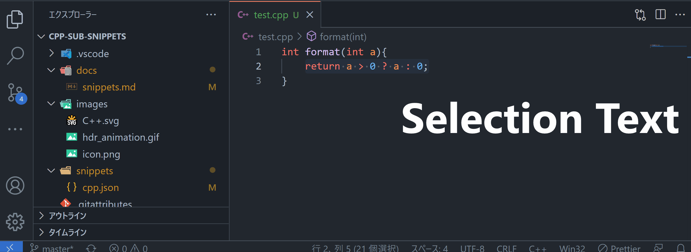

# Snippets example

`$1`-`$9`: placeholders
`$0`: last position

## #if

```cpp
#if $1
$0
#endif // $1
```

## #elif

```cpp
#elif $1
```

## #else

```cpp
#else
```

## #define

```cpp
#define $1
```

## #ifdef

```cpp
#ifdef $1
$0
#endif // $1
```

## #ifndef

```cpp
#ifndef $1
$0
#endif // $1
```

## #include

shortcut: `#inc`

```cpp
#include 
```

## #include-guards

shortcut: `#hdr`

```cpp
#ifndef $1
#define $1
$0
#endif // $1
```

If the file name is `header.hpp`, the default value of `$1` is `HEADER_HPP`.

## has-include

```cpp
#if __has_include($1)
$0
#else
#endif
```

## noreturn

```cpp
//C++11
[[noreturn]]
```

## carries_dependency

```cpp
//C++11
[[carries_dependency]]
```

## deprecated

```cpp
//C++14
[[deprecated("$1")]]$0
```

## nodiscard

```cpp
//C++17
[[nodiscard$1]]$0
```

## maybe_unused

```cpp
//C++17
[[maybe_unused]]
```

## fallthrough

```cpp
//C++17
[[fallthrough]]
```

## no_unique_address

```cpp
//C++20
[[no_unique_address]]
```

## likely

```cpp
//C++20
[[likely]]
```

## unlikely

```cpp
//C++20
[[unlikely]]
```

## concept

```cpp
//C++20
template <class T>
concept $1 = requires (T& $2){
  $0
};
```

## static_assert

```cpp
//C++11.
static_assert($1, "$2");
```

## if-constexpr

```cpp
//C++17
if constexpr($1){
  $0
}
```

## alignas

```cpp
//C++11
alignas($1)
```

## alignof

```cpp
//C++11
alignof($1)
```

## using new name

```cpp
//C++11
using ${1:identifier} = ${2:type};$0
```

## template using new name

```cpp
//C++11
template<${1|class,typename|} ${2:T}>
using ${3:identifier} = ${4:type}<$2>;$0
```

## user defined literal integral

shortcut: `udli`

```cpp
${1:ReturnType} operator "" _${2:suffix}(unsigned long long ${3:count}){
  return $1();$0
}
```

## user defined literal float

shortcut: `udlf`

```cpp
${1:ReturnType} operator "" _${2:suffix}(long double ${3:count}){
  return $1();$0
}
```

## user defined literal character

shortcut: `udlc`

```cpp
${1:ReturnType} operator "" _${2:suffix}(${3|char,wchar_t,char16_t,char32_t|} ${4:str}){
  return $1();$0
}
```

## user defined literal string

shortcut: `udls`

```cpp
${1:ReturnType} operator "" _${2:suffix}(${3|const char*,const wchar_t*,const char16_t*,const char32_t*|} ${4:str}, size_t ${5:N}){
  return $1();$0
}
```

## user defined literal raw

shortcut: `udlr`

```cpp
${1:ReturnType} operator "" _${2:suffix}(const char* ${3:str}){
  return $1();$0
}
```

## user defined literal template

shortcut: `udlt`

```cpp
template<char... ${1:S}>
${2:ReturnType} operator "" _${3:suffix}(){
  return $2();$0
}
```

## coroutine generator class

`#include <coroutine>`

```cpp
class ${1:generator}{
public:
  struct promise_type;
  using handle = std::coroutine_handle<promise_type>;
  struct promise_type{
    ${3:T} ${4:current_value};
    static auto get_return_object_on_allocation_failure() { return $1{nullptr}; }
    auto get_return_object() { return $1{handle::from_promise(*this)}; }
    auto initial_suspend() { return std::suspend_always{}; }
    auto final_suspend() noexcept { return std::suspend_always{}; }
    void unhandled_exception() { std::terminate(); }
    void ${5|return_void,return_value|}() {$0}
    auto yield_value($3 value){
      $4 = value;
      return std::suspend_always{};
    }
  };

  $1($1 const&) = delete;
  $1($1&& rhs)noexcept
    :${2:coro_}(rhs.$2){rhs.$2 = nullptr;}
  ~$1(){if($2) $2.destroy();}
  bool move_next() { return $2? ($2.resume(), !$2.done()) : false; }
  $3 $4(){return $2.promise().$4; }
private:
  $1(handle h):$2(h){}
  handle $2;
};
```

## attr11,14,17,20

```cpp
//attr11
[[${1|noreturn,carries_dependency|}]]

//attr14
[[${1|noreturn,carries_dependency,deprecated("reason")|}]]

//attr17
[[${1|noreturn,carries_dependency,deprecated("reason"),maybe_unused,nodiscard,fallthrough|}]]

//attr20
[[${1|noreturn,carries_dependency,deprecated("reason"),maybe_unused,nodiscard("optional: reason"),fallthrough,no_unique_address,likely,unlikely|}]]
```

## clang-format-off

```cpp
// clang-format off
${0:$TM_SELECTED_TEXT}
// clang-format on
```



## all_of (alg:all_of)

```cpp
std::all_of(std::begin(${1:var}), std::end($1), ${2:[](auto ${3:x}){return ${4:condition};\\}});$0
```

## any_of (alg:any_of)

```cpp
std::any_of(std::begin(${1:var}), std::end($1), ${2:[](auto ${3:x}){return ${4:condition};\\}});$0
```

## none_of (alg:none_of)

```cpp
std::none_of(std::begin(${1:var}), std::end($1), ${2:[](auto ${3:x}){return ${4:condition};\\}});$0
```

## for_each (alg:for_each)

```cpp
std::for_each(std::begin(${1:var}), std::end($1), ${2:[](auto ${3:x}){return $3$4;\\}});$0
```

## for_each_n (alg:for_each_n)

```cpp
std::for_each_n(std::begin(${1:var}), ${2:count ${3:[](auto ${4:x}){return $4$5;\\}});$0
```

## find (alg:find)

```cpp
std::find(std::begin(${1:var}), std::end($1), ${2:value});$0
```

## find_if (alg:find_if)

```cpp
std::find_if(std::begin(${1:var}), std::end($1), ${2:[](auto ${3:x}){return ${4:condition};\\}});$0
```

## find_if_not (alg:find_if_not)

```cpp
std::find_if_not(std::begin(${1:var}), std::end($1), ${2:[](auto ${3:x}){return ${4:condition};\\}});$0
```

## find_end (alg:find_end)

```cpp
std::find_end(std::begin(${1:var1}), std::end($1), std::begin(${2:var2}), std::end($2));$0
```

## find_first_of (alg:find_first_of)

```cpp
std::find_first_of(std::begin(${1:var1}), std::end($1), std::begin(${2:var2}), std::end($2));$0
```

## adjacent_find (alg:adjacent_find)

```cpp
std::adjacent_find(std::begin(${1:var}), std::end($1)${3:
,/*option*/${4:[](auto x, auto y){return ${5:x == y};\\}}});$0
```

## count (alg:count)

```cpp
std::count(std::begin(${1:var}), std::end($1), ${2:value});$0
```

## count_if (alg:count_if)

```cpp
std::count_if(std::begin(${1:var}), std::end($1), ${2:[](auto ${3:x}){return ${4:condition};\\}});$0
```

## mismatch (alg:mismatch)

```cpp
std::mismatch(std::begin(${1:var1}), std::end($1), std::begin(${2:var2})${3:
${4:,/*option1*/std::end($2)}
${5:,/*option2*/${6:BinaryPredicate}}});$0
```

## equal (alg:equal)

```cpp

std::equal(std::begin(${1:var1}), std::end($1), std::begin(${2:var2})${3:
${4:,/*option1*/std::end($2)}
${5:,/*option2*/${6:BinaryPredicate}}});$0
```

## search:i (alg:search:i)

```cpp

std::search(std::begin(${1:var1}), std::end($1), std::begin(${2:var2}), std::end($2)${3:
${4:,/*option*/${5:BinaryPredicate}}});$0
```

## search:s (alg:search:s)

```cpp
std::search(std::begin(${1:var1}), std::end($1), ${2:seacher});$0
```

## search_n (alg:search_n)

```cpp
std::search_n(std::begin(${1:var1}), std::end($1), ${2:count ${3:value});$0
```
